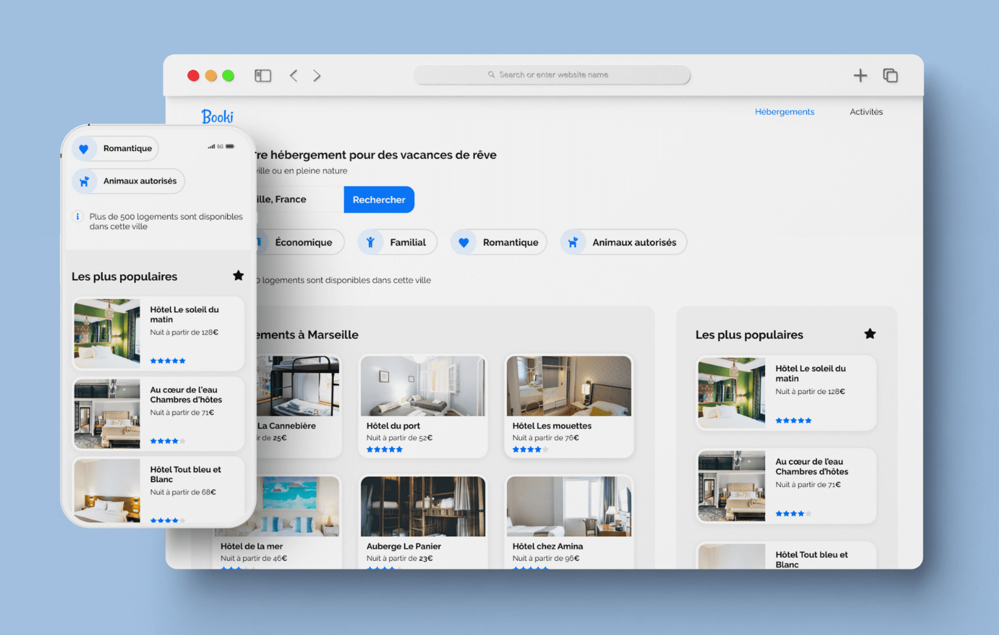

  

    <h1>Booki</h1>
     
    
A modern and responsive website for booking hosting and activities in France

    <h3><a href="https://booki-cem.netlify.app/">🔗 Link to the Website</a></h2>
    
  

## Built With

## Features

- Layout built with Flexbox & Grid
- Smooth animation on hover & scroll
- Responsive website and modern design

## Context of the project

I built this website to validate my training at Openclassrooms
